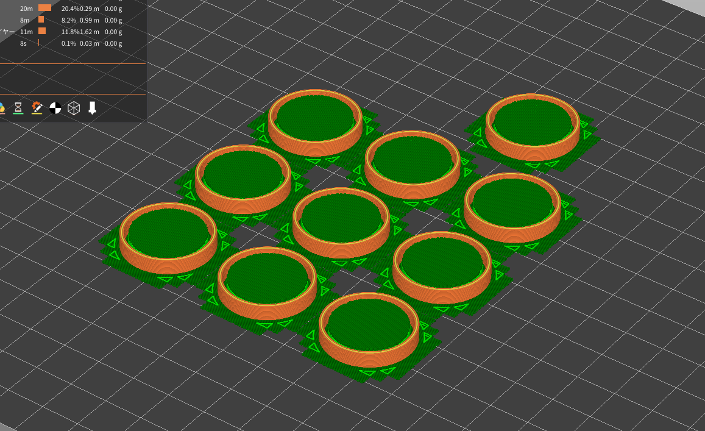
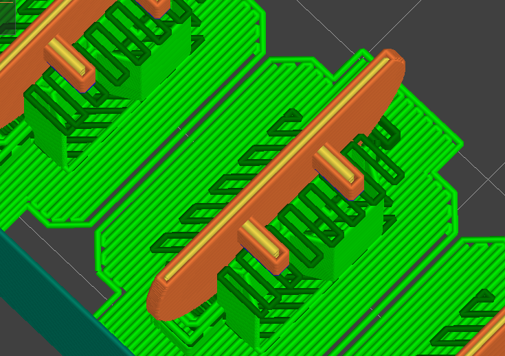
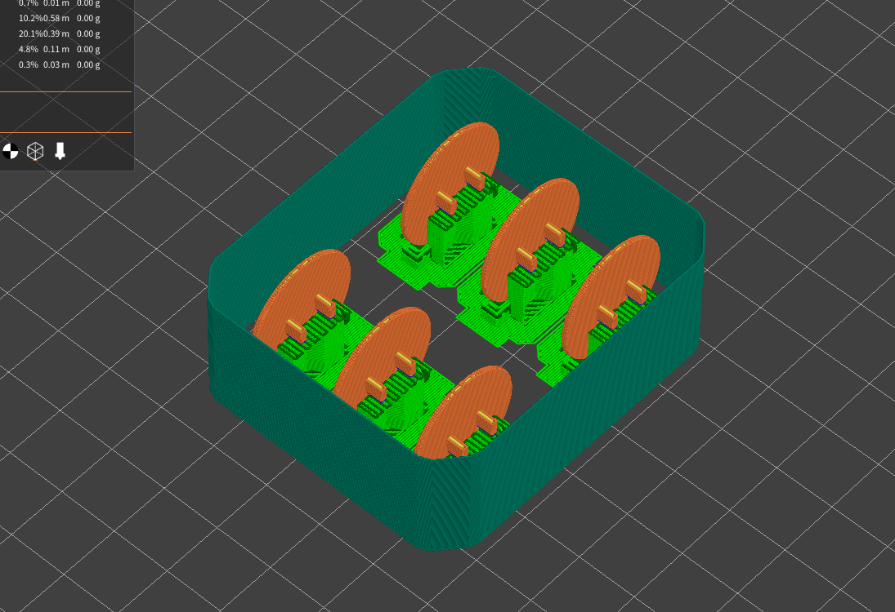

# FDM方式の3Dプリンターでkailh choc v1用キーキャップを作った

レバーレスコントローラー用の丸いキーキャップと、キーボード用の四角いキーキャップの2種類を作りました。キートップ部分はPLA、ステム部分はABSで出力することを前提に分割しています。
後述のCadQueryを導入したあと、pythonファイルの変数をぽちぽちいじれば、欲しいサイズのものが手に入ります。

○ [Kailh choc v1 レバーレスコントローラー用キーキャップ](./source/kailh_choc_v1-circle-keycap.py)
□ [Kailh choc v1 キーキャップ](./source/kailh_choc_v1-rect_keycap.py)

以下は備忘録。

## 使用したもの

### 3Dプリンター
Anycubic社の[Kobra 2](https://www.anycubic.com/products/kobra-2)を購入しました。Amazonにてセール価格で4万円。とても安い。

購入してから一週間、ほぼ毎日動かしていますが、いまのところ特にトラブルもなく扱えています。…いや、オーバーハングがうまく出力できないだとか、ABSフィラメントで印刷したら糸引きがヤバいだとか、そういった3Dプリンター共通のお悩みには苦しめられていますが…Kobra 2自体の問題というのは初心者にはわかりません。なにかあるのかな。

### CAD
[CadQuery](https://github.com/CadQuery/cadquery)というPythonライブラリを使ってモデリングしました。
3DCGソフトウェアのHoudiniのように、手続き的にモデリングすることができます。

併せて、[cq-server](https://github.com/roipoussiere/cadquery-server)もインストールしています。これはWebサーバーを立てて、ブラウザ上でCadQueryのレンダリング結果を確認できるものです。[CQ-editor](https://github.com/CadQuery/CQ-editor)というGUIもあるのですが、自分はWSL2を用いていて、設定が面倒な雰囲気を感じたのでこちらを選んでいます。

使い方は公式ドキュメントの[Examples](https://cadquery.readthedocs.io/en/latest/examples.html)を眺めるのが一番手っ取り早そうです。簡単な形状ならメソッドチェーンで繋げていくだけでも作れるので、普段Pythonを触らない自分でも簡単に書けました。

複雑だったり有機的な形状でないのであれば、CadQueryはサッと書けて好きです。基本的に「そこに書いてあることがすべて」であってほしいので、3DCADソフトのような見る箇所があちこちに点在しているのはあんまり好きではありません。パラメーターをいじるだけで様々なパターンを生み出せるパラメトリックデザインの考えも性に合っています。

### スライサーソフト

特にこだわりがないので、Prusa Slicerを使いました。Anycubic製のものもあるのですが、情報量としてはPrusa Slicerのほうが多いように思います。

Kobra 2 についてくるmicroSDに前述した2つのスライサーソフトが付いてくるので、そこからインストールするのが一番楽でした。
最初、microSD内にあるインストーラーに気付かずに素のPrusa Slicerをインストールしたのですが、Kobra 2のプロファイルが見当たらなくてRedditにあるものをわざわざインストールしてきたりしました。

## 制作記録

以下の事柄を念頭に置きつつ、3Dプリンターの設定をいじったり、モデルを作れば良いのか～と理解しました。

- 熱で溶かしたフィラメントを積層して形状をつくる
- フィラメントごとの素材特性

たとえば、熱で溶かしたフィラメントを積層して形状をつくっていくので、橋の脚と脚の間のように下の支えが無いものは形が崩れがちです。そういう形状をきれいに作りたいのであれば、中空部分を下から支えるサポート材を付ける必要があります。あるいは、ノズルから吐き出されたフィラメントが崩れ落ちてしまう前に形状が固まってくれれば問題ないかもしれません。それなら、ゆっくり吐出されるように速度を落とし、ファンの回転数を上げるよう設定をいじってみる。そういったことです。

スライサーソフトについての動画をいくつか見て、あとは設定いじりながら出力しながらコツをつかむのがよいような。これとか見ていました。
[3Dプリンタスキルアップ配信 Session.1](https://www.youtube.com/watch?v=pkHRVHn5y0Q&t=2114s)

### キーキャップ（PLA製）

#### モデリング
特筆すべきことがない。

#### スライサー

- 長いブリッジなので仕方ないものの、内側のサポート材を剥離するのが大変だった
- 天面はトップインフィルをゆっくり+細く吐出するよう設定するとキレイに仕上がる
    - 天面に限らないけれど
  - 天面のパターンをアルキメデス曲線にしたら格好良かった

### ステム（ABS製）

#### モデリング
- 薄い割にそこそこ精度を求められるので、印刷時の積層ピッチや、吐出幅を念頭にモデリング
  - 吐出幅 0.4mmなら、* 3 して 1.2mm くらいかな～とか…そんなかんじ…

#### スライサー

ABSという素材は冷却速度が早いと反りやすい・収縮しやすいそうで、それ由来のトラブルに苦しめられました。

- スカート > 保護シールドを有効にする
  - 保護シールド（ドラフトシールド）は、モデルの周りにシールドをつくり、熱をシールド内に閉じ込めることで冷却速度をゆるやかにしよう、というもの
  - 造形途中で大きなズレが頻発していて困っていたが、シールドを一緒に印刷することでズレが発生しなくなった
  - 参考: [[FDM】ドラフトシールドによる反り対策](https://note.com/newspeak/n/n590d4590aaf1)
- ベッドにスティックのりを塗る
  - スカートがベッドプレートに定着せず、印刷時に前後左右に動いてしまうので塗った
  - ヘアスプレーのケープとかでも良いらしい
- 積層方向に折れやすいのは諦める
  - どうせキートップと貼り付けるので…それまで丁重に扱えばよいかなと…
  - サポート材と本体を分離する作業に神経を使う
    - めちゃくちゃ折った

あとは別々に出力したキーキャップとステムを接着剤でくっつけておしまい。
気が向いたら完成品の写真を撮ります。オモチャみたいでかわいい。

## 余談
### フィラメントケース

PLAフィラメントは湿度が敵、ということで、キーキャップ作るよりも前にさっさとフィラメントケースを作りました。3Dモデルを公開してくれている先人に感謝。

[無料3D公開！激安3モードの防湿フィラメントケース & ホルダー](https://www.youtube.com/watch?v=bxjvUW-gbow)

作ったのはフィラメントのスプールを置く台にベアリングが使用されているタイプです。湿度を防ぎつつ、フィラメントがスルスルと供給できていていい感じ。

このフィラメントケースがはじめての3Dプリンターでの出力物でした。人様のデータではありますが、出力したものをパチパチと組み立てて形になった瞬間は、出来あいの製品を組み立てたときとはまた違う興奮がありますね。欲しいものを手元でささっと作れるというのは本当に贅沢です。最高～